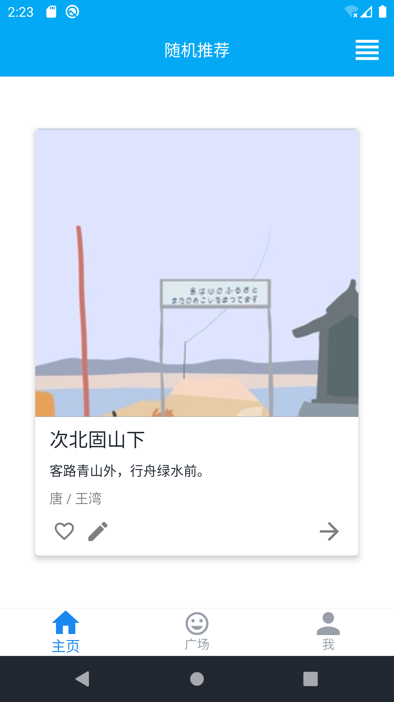

# PoemNote

一个简单的诗词笔记App，内置《唐诗三百首》和一千多条「一言」语录，完全使用Kotlin开发，之前用来完成某次作业 + 学习Kotlin

最近整理代码的时候发现了这份代码，感觉还可以，修修改改，把一些bug的坑给填上了，然后开源出来~

## Features

- 随机诗词卡片
- 记录诗词笔记
- 笔记分享广场
- 多用户支持
- ...

## Dependencies

- 腾讯的 QMUI 组件库
- ObjectBox 数据库
- Iconics 图标组件
- Google Material Design 图标
- Fontawesome 图标
- EventBus
- Picasso
- ...

## Screenshots

| 首页                                                         | 诗词阅读                                                     | 诗词列表                                                     |
| ------------------------------------------------------------ | ------------------------------------------------------------ | ------------------------------------------------------------ |
|  |  |  |
| 笔记广场                                                     | 用户中心                                                     | 用户列表                                                     |
|  |  |  |


## 旧文

Kotlin好用的一批，继用Kotlin写Springboot之后，我又来试试Android开发……

App架构图~~（作业需要）~~


## Activity 和 Fragment 的选择

换做以前肯定无脑上几十个Activity，然后页面跳来跳去的。

不过因为我们项目要用到QMUI，于是我认真读了QMUI在Github上的Wiki和作者的博客，看到作者在比较 Activity 和 Fragment，互有利弊，Fragment更加轻量，而且QMUI的示例项目里面也大量运用了Fragment，所以我就决定这个项目直接用上极端的单Activity多Fragment架构……

关于Activity还是Fragment，可以看QMUI作者的这篇博客：http://blog.cgsdream.org/2019/12/15/qmui-gank-02/

Fragment之间的切换用到QMUI的`QMUIFragmentActivity`这个工具，挺方便的，用起来和Flutter的路由跳转差不多吧：

```kotlin
// 跳转到 Home
val intent = QMUIFragmentActivity.intentOf(
    this,
    CommonHolderActivity::class.java,
    MainFragment::class.java
)
startActivity(intent)
```

全部的Fragment都是用`CommonHolderActivity`来承载，`CommonHolderActivity`的代码定义如下，可以看到需要在`FirstFragments`注解中先注册我们要用到的Fragment，是不是很像Flutter的路由注册？

```kotlin
@FirstFragments(
    value = [
        MainFragment::class,
        PoemListFragment::class,
        PoemFragment::class,
        SignUpFragment::class,
        SignInFragment::class
    ]
)
// 使用 @DefaultFirstFragment 来指定默认的 First Fragment，这时 new Intent(context, CommonHolderActivity::class.java) 就会启用默认的 First Fragment
@DefaultFirstFragment(MainFragment::class)
class CommonHolderActivity : QMUIFragmentActivity() {
    override fun getContextViewId(): Int {
        // 提供 FragmentContainer 的 id
        return R.id.app_common_holder_fragment_container
    }
}
```

## QMUI

前面好像还没介绍到QMUI，这是腾讯开源的一个AndroidUI框架，可以用比较少的代码实现好看的界面，其实我很早就看到这个了，但是一直没有使用，为什么呢？因为它犯了国内开源项目的通病——文档资料匮乏、官方文档质量不高。

因为文档不是很好（看起来文档应该是停止维护了），对Android新手真的挺劝退的，一个简单的功能在QMUI开发者团队的大佬看来小菜一碟，但是新手总是会因为这样那样的细节问题没搞懂，卡在一个地方很久。没有一个Quick Start是真的难顶。

现在这个项目重新选择了QMUI，一方面是Android平台上好用的开源UI框架好像没有别的选择了？一方面是经过这些时间被Android的摧残，我已经上手这方面的开发，可以直接看QMUI的代码来撸一个界面出来了……

本文就来介绍几个组件的简单使用

### Topbar

### PagerSnapHelper

### QMUITopBarLayout

### QMUIViewPager

### QMUITabSegment

### 相关文档：

- Github Wiki：https://github.com/Tencent/QMUI_Android/wiki
- 官网的马虎应付的文档：https://qmuiteam.com/android/documents/


## ORM: ObjectBox

之前我用的是Greendao，性能蛮高的，数据库用的是SQLite，然后还是这个作者，出了新版的ObjectBox，100%适配Kotlin，舒服的一批，这东西准确说是个数据库

### 参考

- ObjectBox数据库官方文档：https://docs.objectbox.io/getting-started

## EventBus

### 参考资料

- EventBus3 简单使用及注意点：https://www.cnblogs.com/jp1017/p/5668257.html
- Android EventBus使用注意事项：https://blog.csdn.net/LVXIANGAN/article/details/74202647
- EventBus 的使用（包括Stick事件）：https://juejin.cn/post/6844903969395851272#heading-4

## 图标组件

超好用的一款图标组件：https://github.com/mikepenz/Android-Iconics

附上我比较常用的Material Design图标库：https://material.io/resources/icons/


## Kotlin Android开发资料

- https://www.cnblogs.com/Jetictors/p/9227498.html
- https://blog.csdn.net/aqi00/article/details/75283548